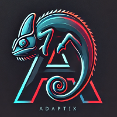

# AXS Language Support for VSCode

A Visual Studio Code extension for AXS (AdaptixC2 Scripting Language) with intelligent autocompletion and syntax highlighting.



## 🚀 Features

- **Smart Autocompletion** - Full `ax.`, `form.`, `menu.` object support
- **JavaScript Syntax** - Complete JS highlighting and language features  
- **BOF Integration** - Built-in support for Beacon Object Files
- **Form Dialogs** - UI creation with form widgets and layouts
- **Extensible** - Easy to add new AXS API functions

## ⚡ Quick Start

1. Install the extension
2. Open any `.axs` file 
3. Type `ax.` to see all available functions
4. Use `Tab` to navigate through parameters

## 📖 Example Usage

```javascript
// Create a BOF command
var cmd = ax.create_command("screenshot", "Take screenshot", "screenshot -p 1234");
cmd.addArgInt("pid", true);
cmd.setPreHook(function(id, cmdline, parsed_json) {
    let pid = parsed_json["pid"];
    let bof_params = ax.bof_pack("int", [pid]);
    let bof_path = ax.script_dir() + "_bin/screenshot.o";
    ax.execute_alias(id, cmdline, `execute bof ${bof_path} ${bof_params}`, "Screenshot");
});

// Create form dialog
let dialog = form.create_dialog("Settings");
let label = form.create_label("Enter value:");
let input = form.create_textline();
form.connect(input, "textChanged", function(text) {
    ax.log("Input changed: " + text);
});
```
## 📄 License

MIT License - See [LICENSE](LICENSE) file

## 🔗 Links

- [AdaptixC2 Documentation](https://adaptix-framework.gitbook.io/adaptix-framework/)
- [AXScript Reference](https://adaptix-framework.gitbook.io/adaptix-framework/development/axscript)
- [GitHub Repository](https://github.com/5P34R/axs-extension)
